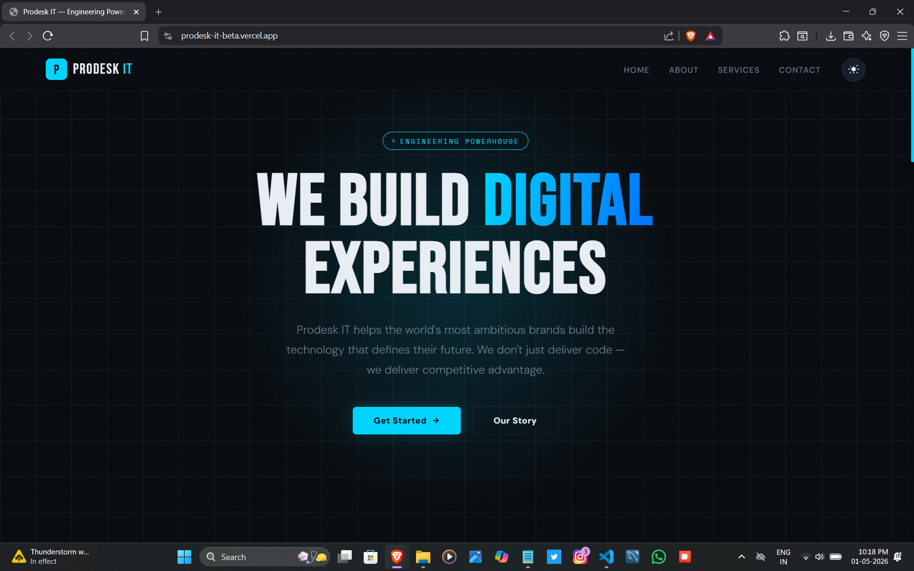
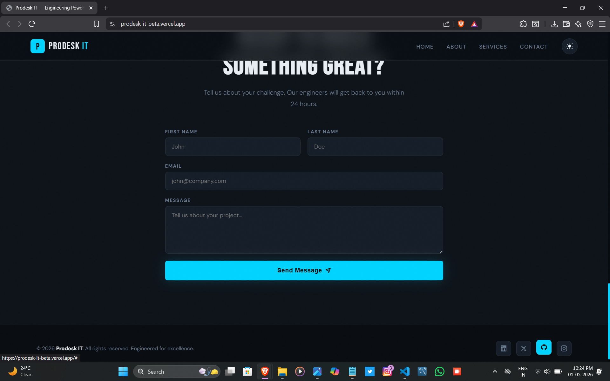
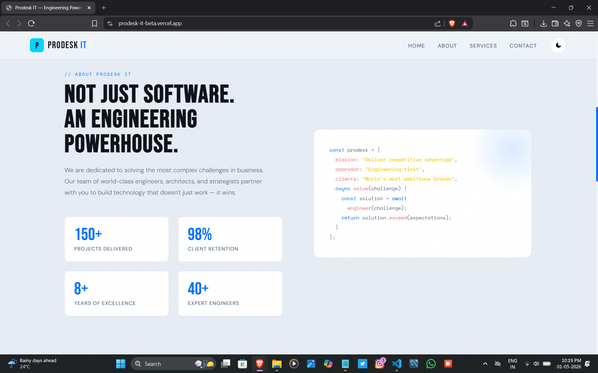
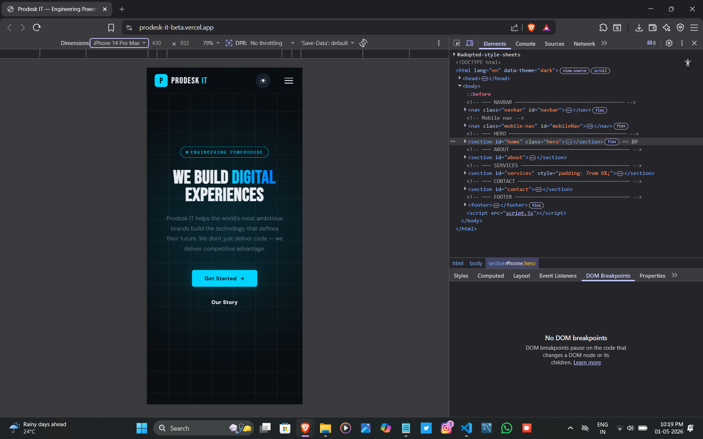
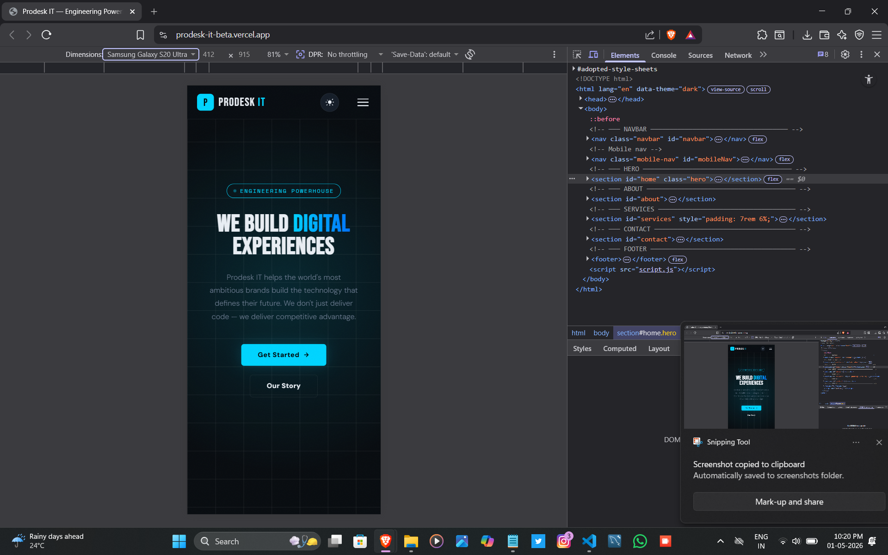

# Prodesk IT — Engineering Powerhouse

A modern, responsive landing page for **Prodesk IT**, a full-service software engineering and digital marketing agency. Built with vanilla HTML, CSS, and JavaScript — no frameworks or build tools required.

---

## 📁 Project Structure

```
├── index.html      # Main HTML document (all sections & markup)
├── styles.css      # Styling, theming, animations, and responsive layout
└── script.js       # Dark/light toggle & mobile nav logic
```

---

## ✨ Features

- **Dark / Light Theme** — Toggleable via the sun/moon icon in the navbar; defaults to dark mode
- **Responsive Layout** — Fully mobile-friendly with a hamburger menu drawer on smaller screens
- **Smooth Scroll Navigation** — Anchor links scroll smoothly to each section
- **Animated Hero Section** — Pulsing glow orb, grid background, and staggered fade-up entrance animations
- **Services Cards** — Hover effects with accent glow and animated "Learn More" arrow
- **Contact Form** — Styled input fields with focus glow states
- **Social Footer** — Links to LinkedIn, X (Twitter), GitHub, and Instagram

---

## 🗂️ Sections

| Section | ID | Description |
|---|---|---|
| Navbar | `#navbar` | Fixed top bar with logo, nav links, theme toggle, and hamburger |
| Hero | `#home` | Full-viewport intro with headline, subtext, and CTA buttons |
| About | `#about` | Company overview, code snippet visual, and key stats |
| Services | `#services` | Three service cards: SEO, Web Development, Digital Marketing |
| Contact | `#contact` | Contact form with name, email, and message fields |
| Footer | — | Copyright notice and social media icon links |

---

## 🎨 Design System

### Fonts
- **Bebas Neue** — Display headings and section titles
- **DM Sans** — Body text and UI elements
- **Space Mono** — Code blocks, labels, and monospace accents

### Color Tokens (CSS Custom Properties)

| Token | Dark Mode | Light Mode |
|---|---|---|
| `--bg` | `#080c10` | `#f0f4f8` |
| `--accent` | `#00d4ff` | `#0070ff` |
| `--accent2` | `#0070ff` | `#005fd4` |
| `--text` | `#e8edf3` | `#0d1219` |
| `--muted` | `#6b7b90` | `#5a6a80` |
| `--surface` | `#151d28` | `#ffffff` |

Themes are applied via `data-theme="dark|light"` on the `<html>` element.

---

## 📱 Responsive Breakpoints

| Breakpoint | Behaviour |
|---|---|
| `> 900px` | Full desktop layout — horizontal nav links visible |
| `≤ 900px` | Nav links hidden; hamburger menu shown; about section stacks vertically; services grid becomes 2 columns |
| `≤ 600px` | Services grid becomes 1 column; contact form row stacks; hero buttons stack vertically |

---

## 📸 Screenshots

### 🖥️ Desktop View



### 🌙 Dark Mode



### ☀️ Light Mode



### 📱 Mobile — iPhone



### 🤖 Mobile — Android


